<h1 align="center">Hey  I'm Moman_Amjad</h1>
<h3 align="center">Software Engineer</h3>

  

## 📌 About Me
- I`m currently learning in MERN Stack .
- Also a CS Student .
- Looking  for open source problems to learn and solve.
- Feel free to ask .
- Intrested in Modern Tools and Techs.

## 🧠 My Focus Areas
- Web Development
- Open Source Contribution

## 📊 GitHub Stats & Trophies

  
  

  

   

  

  

## 🛠️ Languages & Tools

<h3 align="center">Programming Languages</h3>

  
  
  
  

<h3 align="center">Frontend</h3>

  
  
  
  
  
  

<h3 align="center">Backend</h3>

  
  

<h3 align="center">Database</h3>

  
  

<h3 align="center">DevOps & Cloud</h3>

  

<h3 align="center">Tools</h3>

  
  
  
  
  
  

  

 

## 🔗 Connect with Me

  
  
  
  

## 💬 Quote
> There are two ways to write error-free programs; only the third one works.

<picture>
  <source media="(prefers-color-scheme: dark)" srcset="https://raw.githubusercontent.com/abozanona/abozanona/output/pacman-contribution-graph-dark.svg">
  <source media="(prefers-color-scheme: light)" srcset="https://raw.githubusercontent.com/abozanona/abozanona/output/pacman-contribution-graph.svg">
  
</picture>

  

